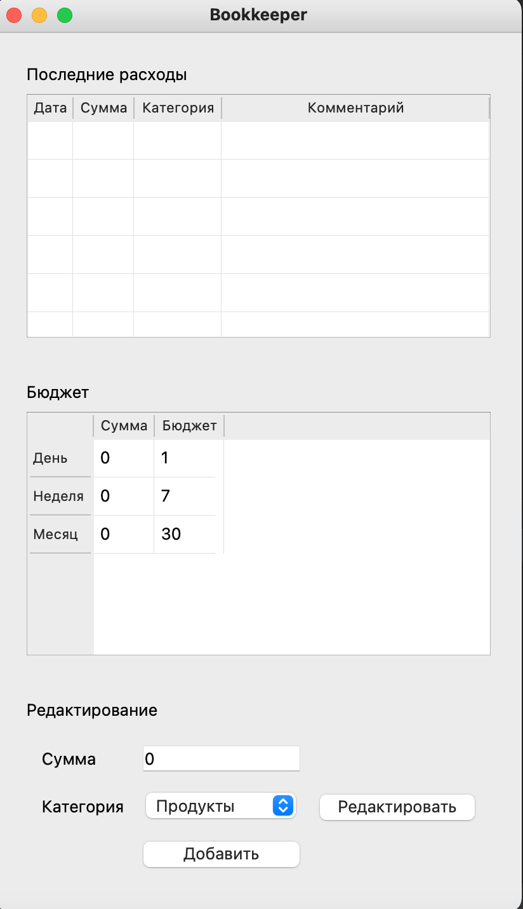

# Приложение для управления личными финансами
#### (учебный проект для курса по практике программирования на Python)

Архитектура проекта:


Структура файлов
и каталогов (модулей и пакетов) отражает архитектуру:

📁 bookkeeper - исполняемый код 

- 📁 models - модели данных

    - 📄 budget.py - бюджет
    - 📄 category.py - категория расходов
    - 📄 expense.py - расходная операция
- 📁 repository - репозиторий для хранения данных

    - 📄 abstract_repository.py - описание интерфейса
    - 📄 memory_repository.py - репозиторий для хранения в оперативной памяти
    - 📄 sqlite_repository.py - репозиторий для хранения в sqlite
- 📁 view - графический интерфейс
- 📄 simple_client.py - простая консольная утилита, позволяющая посмотреть на работу программы в действии
- 📄 utils.py - вспомогательные функции

📁 tests - тесты (структура каталога дублирует структуру bookkeeper)

Для того чтобы запустить проект необходимо запустить App.py

```commandline
python bookkeeper/app.py 
```

В соответствии с техническим заданием  необходимо было реализовать приложение вида:


В ходе реализации приложения был достигнут определенный успех, однако еще предстоит много работы с этим учебным проектом: 


